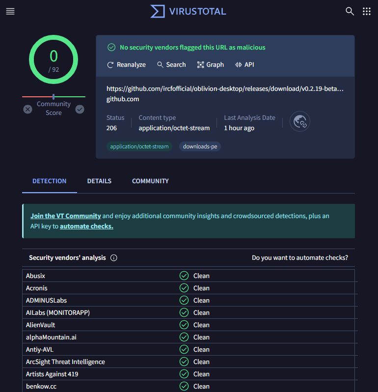

# Oblivion Desktop - Unofficial Warp Client for Windows/Mac/Linux

"Internet, for all or none!"

---

Unofficial Desktop version of [oblivion](https://github.com/bepass-org/oblivion)

Oblivion provides secure, optimized internet access through a user-friendly Windows/Mac/Linux app using cloudflare warp
technology

## Features

- **Secure VPN**: Custom WireGuard implementation in Go.
- **User-Friendly**: Simple, intuitive interface.

## Download

<table>
    <thead align=left>
        <tr>
            <th>OS</th>
            <th>Download</th>
        </tr>
    </thead>
    <tbody align=left>
        <tr>
            <td>Windows</td>
            <td>
                 
                
            </td>
        </tr>
        <tr>
            <td>macOS</td>
            <td>
                 
                
            </td>
        </tr>
        <tr>
            <td>Linux</td>
            <td>
                 
                 
                
            </td>
        </tr>
        <tr>
        <td>Android</td>
            <td>
                
            </td>
        </tr>
        <tr>
        <td>iOS</td>
            <td>
                Coming Soong ...
            </td>
        </tr>
    </tbody>
</table>

## Get Involved

We're a community-driven project, aiming to make the internet accessible for all. Whether you want to contribute code,
suggest features, or need some help, we'd love to hear from you! Check out
our [GitHub Issues](https://github.com/ircfofficial/oblivion-desktop/issues) or submit a pull request.

## Dev Docs

[DOCS.md](DOCS.md)

## Restrictive License

[License.md](LICENSE.md)
