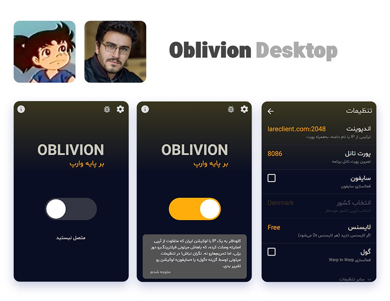
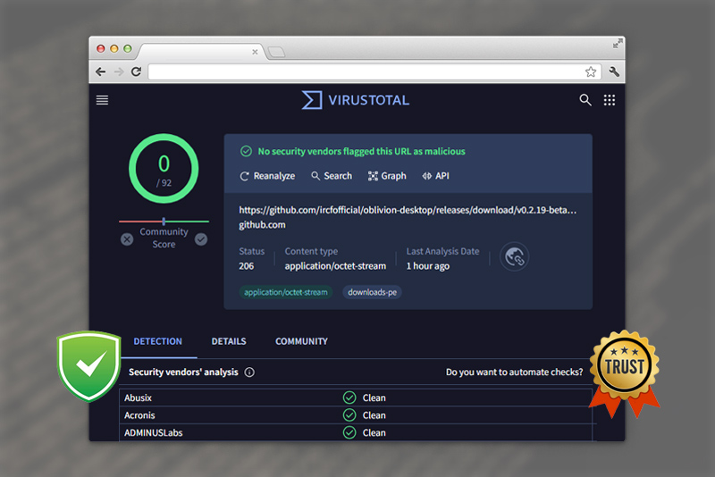

    <h1>Oblivion Desktop</h1>

    

        <a href="README-fa.md">
            <small>فارسی</small>
            
        </a>
        | 
       
        <small>English</small>
    

Oblivion provides secure, optimized internet access through a user-friendly Windows/Mac/Linux app using cloudflare warp
technology

> Unofficial Desktop version of [Oblivion](https://github.com/bepass-org/oblivion)

<b>"Internet, for all or none!"</b>

## Features

- **Secure VPN**: Custom WireGuard implementation in Go.
- **Open Source**: Built with transparency & community contribution in mind, leveraging the power of GitHub Actions for automated builds.
- **User-Friendly**: Simple, intuitive interface.

## Quick Overview

<table>
    <thead align=left>
        <tr>
            <th>Feature</th>
            <th>Status</th>
        </tr>
    </thead>
    <tbody align=left>
        <tr>
            <td>Method</td>
            <td>
                :white_check_mark:  Warp & Warp+  
                :white_check_mark:  Gool 
                :white_check_mark:  Cfon <small>(Psiphon)</small>
            </td>
        </tr>
        <tr>
            <td>Network Configuration</td>
            <td>
                :white_check_mark: Proxy <small>(No Change)</small> 
                :white_check_mark: System Proxy <small>(with PAC)</small> 
                :white_check_mark: TUN <small>(with SingBox)</small>
            </td>
        </tr>
        <tr>
            <td>Routing Rules</td>
            <td>
                :white_check_mark: System Proxy 
                :white_check_mark: GeoDB
            </td>
        </tr>
        <tr>
            <td>System Tray</td>
            <td>
                :white_check_mark:  Minimize 
                :white_check_mark: BootUp 
                :white_check_mark: Shortcuts
            </td>
        </tr>
        <tr>
            <td>Languages</td>
            <td>
                :white_check_mark:  Persian (Farsi)  
                :white_check_mark:  English  
                :white_check_mark:  Chinese  
                :white_check_mark:  Russian  
                :white_check_mark:  Turkish  
                :white_check_mark:  Indonesian  
                :white_check_mark:  Arabic  
                :white_check_mark:  Portuguese  
                :white_check_mark:  Vietnamese  
                :white_check_mark:  Urdu  
                :white_check_mark:  Spanish  
                :white_check_mark:  Burmese  
                :white_check_mark:  Amharic
            </td>
        </tr>
        <tr>
            <td>Theme</td>
            <td>
                :white_check_mark: Light 
                :white_check_mark: Dark 
                :white_check_mark: RTL 
                :white_check_mark: LTR 
                :white_check_mark: Auto
            </td>
        </tr>
        <tr>
            <td>Other</td>
            <td>
                :white_check_mark: Scanner 
                :white_check_mark: Ping 
                :white_check_mark: Accessibility 
                :white_check_mark: SpeedTest 
                :white_large_square: Inline Update 
                :white_large_square: Kill Switch
            </td>
        </tr>
    </tbody>
    </table>

## Download

    <table>
        <thead align="left">
            <tr>
                <th>OS</th>
                <th>Download</th>
                <th>Compatibility</th>
            </tr>
        </thead>
        <tbody align="left">
            <tr>
                <td>Windows</td>
                <td>
                     
                     
                     
                     
                     
                     
                </td>
                <td>
                    10+ 
                </td>
            </tr>
            <tr>
                <td>macOS</td>
                <td>
                     
                     
                     
                    
                </td>
                <td>10.15+</td>
            </tr>
            <tr>
                <td>Linux</td>
                <td>
                     
                     
                     
                         
                     
                                  
                </td>
                <td>
                    Gnome 
                    KDE
                </td>
            </tr>
            <td>Android</td>
                <td>
                     
                    
                </td>
                <td>6+</td>
            </tr>
            <tr>
                <td>iOS</td>
                <td>
                    <small>Coming Soon ...</small>
                </td>
                <td></td>
            </tr>
        </tbody>
    </table>

## Faced Bug 🐞?

checkout [wiki](https://github.com/bepass-org/oblivion-desktop/wiki) and search
in [issues](https://github.com/bepass-org/oblivion-desktop/issues) (open
and [closed](https://github.com/bepass-org/oblivion-desktop/issues?q=is%3Aissue+is%3Aclosed) ones!) and if you didn't
get your answer, then [create a new issue](https://github.com/bepass-org/oblivion-desktop/issues/new/choose).

## Get Involved

We're a community-driven project, aiming to make the internet accessible for all. Whether you want to contribute code,
suggest features, or need some help, we'd love to hear from you!  
Check out
our [GitHub Issues](https://github.com/bepass-org/oblivion-desktop/issues), [Contribution Guide](CONTRIBUTING.md)
and [Developer Docs](DOCS.md).

## Know more

* [FAQ.md](FAQ.md)
* [License.md](LICENSE.md)
* [SECURITY.md](SECURITY.md)

## Acknowledgements

This project stands on the shoulders of giants, and we are deeply grateful for the contributions and inspiration
provided by the following friends:

- [Cloudflare Warp](https://www.cloudflare.com/application/terms/)
- [warp-plus](https://github.com/bepass-org/warp-plus/) (Yousef Ghobadi & Mark Pashmfouroush)
- [Oblivion](https://github.com/bepass-org/oblivion)
- [Oblivion Helper](https://github.com/ShadowZagrosDev/oblivion-helper)
- [Electron](https://www.electronjs.org/)
- [React](https://github.com/facebook/react)
- [electron-react-boilerplate](https://github.com/electron-react-boilerplate/electron-react-boilerplate)
- [electron-builder](https://github.com/electron-userland/electron-builder)
- [regedit](https://www.npmjs.com/package/regedit)
- [sing-box](https://github.com/SagerNet/sing-box)
- [Iran Sing-box rules](https://github.com/Chocolate4U/Iran-sing-box-rules)
- [Shabnam Font](https://rastikerdar.github.io/shabnam-font/) (Saber Rastikerdar)
- [Zag-NetStats](https://github.com/ShadowZagrosDev/Zag-NetStats)
- [and others 🧡](package.json)

## Contributors

Oblivion Desktop made possible by you. ✌️ We appreciate your help and support. 🧡 ([Contribution Guide](CONTRIBUTING.md))

