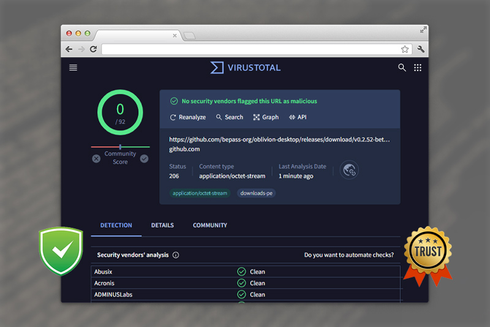

# امنیت برنامه

اپ متن‌باز Oblivion به‌عنوان یکی‌از امن‌ترین و مطمئن‌ترین VPNها، در روزهای پراختلال اخیر نقش مهمی برای دسترسی آزاد
کاربران ایرانی به اینترنت ایفا کرده.

- اپ‌های Oblivion و Oblivion Deskop و همینطور هسته Warp-Plus متن‌باز هستن و سورسشون در گیت‌هاب قرار گرفته، ضمن اینکه
  بیلد پروژه‌ها به‌صورت خودکار توسط گیت‌هاب اکشن انجام می‌شن.
- وارپ به‌وسیله رمزنگاری مقدار بیشتری از ترافیک خروجی از دستگاهتون، اجازه نمیده هیچ‌کس در کار شما سرک بکشه.
- نتیجه بررسی برنامه در VirusTotal فاقد هرگونه ایراد بوده است.

# Application Security

The open-source Oblivion application, recognized as one of the most secure and reliable VPN providers, has played a crucial role in providing unrestricted internet access for Iranian users during recent disruptions going on in Iran.

- The Oblivion and Oblivion Desktop programs, as well as the WARP-Plus core, are open-source and their source code is available on their respective GitHub repositories. Additionally, project builds are automatically handled by GitHub Actions.
- WARP uses encryption to protect a larger portion of your device's outgoing traffic, ensuring that no one can monitor your activities.
- The program's results on VirusTotal have shown no issues.
